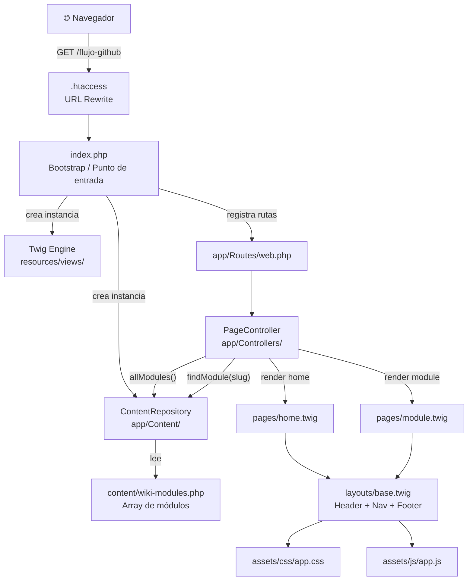

# Arquitectura de VERMQEN Wiki — Análisis y Propuesta Modular

## 1. Stack Tecnológico Actual

| Capa | Tecnología |
|---|---|
| Lenguaje | PHP 8.2 |
| Framework HTTP | Slim 4 |
| Templates | Twig 3 |
| CSS Framework | Bootstrap 5.3 |
| JS reactivo | Alpine.js 3 |
| Animaciones | AOS (Animate On Scroll) |
| Iconos | Bootstrap Icons |
| Tipografía | Inter + Plus Jakarta Sans (Google Fonts) |
| Dependencias | Composer / PSR-4 autoload |

---

## 2. Arquitectura Actual — Cómo se conecta todo



### Flujo de una petición

```
1. Navegador  ──▶  .htaccess (rewrite clean URLs)
2. .htaccess  ──▶  index.php (bootstrap de Slim + Twig)
3. index.php  ──▶  app/Routes/web.php (registra GET / y GET /{slug})
4. Router     ──▶  PageController::home() o PageController::module()
5. Controller ──▶  ContentRepository::allModules() / findModule($slug)
6. Repository ──▶  content/wiki-modules.php (fuente de datos PHP array)
7. Controller ──▶  Twig::render(pages/home.twig | pages/module.twig)
8. Twig       ──▶  extends layouts/base.twig → HTML final al navegador
```

---

## 3. Problemas actuales para escalar a 10+ módulos

| Problema | Dónde ocurre | Impacto |
|---|---|---|
| **Todo el contenido en un solo archivo** | `content/wiki-modules.php` | Archivo enorme, difícil de mantener por módulo |
| **`module.twig` es monolítico** | `pages/module.twig` | Cada módulo tiene las mismas secciones hardcodeadas (pillars, workflow, checklist…). Algunos módulos no necesitarán todas |
| **`PageController` hace demasiado** | `PageController.php` | Maneja rutas, normalización de URLs, base path, navegación — violación de SRP |
| **Sin agrupación por categorías** | `content/` | Con 10+ módulos el navbar se desbordará |
| **Views de documentación vacías o sueltas** | `views-documentacion/` | Carpeta paralela sin integración clara con el sistema |
| **Sin capa de configuración** | `index.php` | Opciones del app (cache, basePath, debug) están inline |
| **`legacyPath` hardcodeado** | `PageController`, templates | Acoplamiento a una ruta específica |

---

## 4. Opciones de Mejora (de menor a mayor impacto)

---

### ✅ Opción A — Refactor mínimo: Separar contenido por archivo (RECOMENDADA para empezar)

**Filosofía**: mantener la misma arquitectura, solo organizar el contenido.

#### Estructura propuesta

```
content/
├── modules/
│   ├── flujo-github.php          ← ya existe
│   ├── ejecucion-inicial.php     ← nuevo
│   ├── base-de-datos.php         ← nuevo
│   ├── autenticacion.php         ← nuevo
│   └── ... (un archivo por módulo)
└── wiki-modules.php              ← ahora solo los "carga" y los une
```

#### `content/wiki-modules.php` nuevo rol (solo index)
```php
<?php
// Carga dinámica: cualquier archivo en modules/ se registra automáticamente
$modules = [];
foreach (glob(__DIR__ . '/modules/*.php') as $file) {
    $slug = basename($file, '.php');
    $modules[$slug] = require $file;
}
return $modules;
```

**Ventaja**: cero cambios en PHP del core. Cada módulo es un archivo independiente.

---

### ✅ Opción B — Modular con categorías (RECOMENDADA para 10+ módulos)

Agrega un nivel de agrupación por categoría en el contenido y en el nav.

#### Estructura de contenido
```
content/
├── modules/
│   ├── core/
│   │   ├── flujo-github.php
│   │   └── ejecucion-inicial.php
│   ├── backend/
│   │   ├── autenticacion.php
│   │   └── base-de-datos.php
│   └── frontend/
│       ├── componentes-ui.php
│       └── temas-estilos.php
└── wiki-modules.php
```

#### Cambio en el módulo data — nuevo campo `category`
```php
// content/modules/core/flujo-github.php
return [
    'category' => 'core',
    'nav'      => 'Flujo GitHub',
    'title'    => 'Flujo de trabajo con GitHub',
    // ...
];
```

#### Cambio en navegación — agrupado
El navbar mostraría un dropdown por categoría en lugar de enlaces sueltos.

---

### ✅ Opción C — Multi-template por tipo de módulo

Diferentes módulos tienen diferente estructura visual. En lugar de un `module.twig` genérico con todas las secciones, crear **tipos de plantilla**.

```
resources/views/
├── layouts/
│   └── base.twig
├── pages/
│   ├── home.twig
│   └── not-found.twig
└── modules/                        ← NUEVO
    ├── default.twig                ← pillars + workflow + checklist
    ├── reference.twig              ← tablas de referencia técnica
    ├── tutorial.twig               ← paso a paso numerado
    └── overview.twig               ← descripción + arquitectura
```

En el array del módulo se agrega:
```php
'template' => 'modules/tutorial.twig',
```

En `PageController::module()`:
```php
$template = $module['template'] ?? 'modules/default.twig';
return $this->twig->render($response, $template, [...]);
```

---

### ✅ Opción D — Separar responsabilidades en el Controller

Dividir `PageController` en piezas más pequeñas:

```
app/
├── Controllers/
│   ├── HomeController.php         ← solo home()
│   └── ModuleController.php       ← solo module()
├── Content/
│   ├── ContentRepository.php      ← sin cambios
│   └── ModuleLoader.php           ← carga dinámica de archivos
├── Navigation/
│   └── NavigationBuilder.php      ← buildNavigation() extraído
├── Http/
│   └── PathHelper.php             ← detectBasePath, routePath, assetBase
└── Routes/
    └── web.php
```

---

## 5. Estructura Final Recomendada (Opciones A + B + C combinadas)

```
vermqen/
├── index.php                            ← punto de entrada (limpio)
├── composer.json
├── .htaccess
│
├── app/
│   ├── Bootstrap/
│   │   └── Application.php             ← factory que arma el App de Slim
│   ├── Controllers/
│   │   ├── HomeController.php
│   │   └── ModuleController.php
│   ├── Content/
│   │   ├── ContentRepository.php
│   │   └── ModuleLoader.php            ← carga archivos de content/modules/
│   ├── Navigation/
│   │   └── NavigationBuilder.php
│   ├── Http/
│   │   └── PathHelper.php
│   └── Routes/
│       └── web.php
│
├── content/
│   ├── wiki-modules.php                ← index que llama a ModuleLoader
│   └── modules/
│       ├── core/
│       │   ├── flujo-github.php
│       │   └── ejecucion-inicial.php
│       ├── backend/
│       │   ├── autenticacion.php
│       │   └── base-de-datos.php
│       ├── frontend/
│       │   └── componentes-ui.php
│       └── devops/
│           └── deploy-proceso.php
│
├── resources/
│   └── views/
│       ├── layouts/
│       │   └── base.twig
│       ├── pages/
│       │   ├── home.twig
│       │   └── not-found.twig
│       └── modules/                    ← templates por tipo de módulo
│           ├── default.twig
│           ├── tutorial.twig
│           └── reference.twig
│
└── assets/
    ├── css/
    │   └── app.css
    └── js/
        └── app.js
```

---

## 6. Plan de Implementación por Fases

| Fase | Qué hacer | Esfuerzo | Impacto |
|---|---|---|---|
| **1** | Separar contenido: 1 archivo PHP por módulo | Bajo | Alto — inmediato |
| **2** | Agregar campo `category` y agrupar en nav | Medio | Alto — UX mejorada |
| **3** | Multi-template por tipo de módulo | Medio | Alto — flexibilidad |
| **4** | Separar Controller + extraer PathHelper + NavigationBuilder | Medio | Medio — mantenibilidad |
| **5** | Agregar `Bootstrap/Application.php` para limpiar `index.php` | Bajo | Medio — limpieza |

> [!TIP]
> **Empieza por la Fase 1.** Es la de mayor impacto con menor riesgo: separa los módulos en archivos individuales sin cambiar nada de la arquitectura PHP/Twig. Una vez que tengas 10 archivos en `content/modules/`, las demás fases se implementan de forma natural.

> [!IMPORTANT]
> La **carga dinámica automática** (con `glob()` en `wiki-modules.php`) es clave: agregas un nuevo archivo PHP en `content/modules/` y automáticamente aparece en el nav, en el home y tiene su URL — sin tocar el código PHP del core.

> [!NOTE]
> El campo `'template'` (Fase 3) permite que cada módulo decida su propio layout visual. Un módulo de "base de datos" puede usar `reference.twig` con tablas, mientras que "ejecución inicial" usa `tutorial.twig` con pasos numerados.
